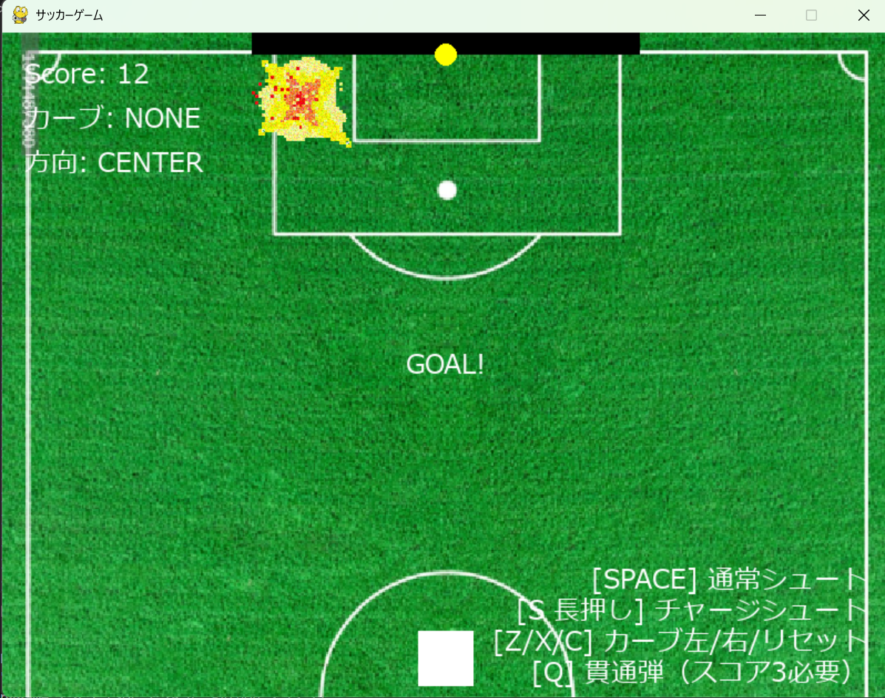

# PKゲーム

## 実行環境の必要条件
* python >= 3.10
* pygame >= 2.1

## ゲームの概要
* PKでボールをシュートする側になってゴールを狙うゲーム

## ゲームの遊び方
* 矢印キーでシュートするコースを決めて、スペースで打つ
* キーパーにボールがあったてしまったら失敗NoGoal
* Sキー長押しでチャージシュート
* スコアが3点以上あるとき、Qキー押してスコア1点分消費することで、キーパー貫通する球を打てる
* Z,Xキー押すと左,右カーブの球を打てる。3段階までカーブ力を上げられて、カーブさせたい段階分キーを押す。Cキーでキャンセル

## ゲームの実装
*　4スコア以上取っている状態だとキーパーが巨大化
### 共通基本機能
* 背景画像と操作選手の描画

### 分担追加機能
* キーパーがでかくなるなどのキーパー強化クラス(担当:平)
* シュートする側がシュートが速くなるなどの選手の強化クラス（担当:大澤）
* ボール分裂などのボールに関するクラス （担当:水口）
* 一定確率でボールを打つと、そのボールがキーパーを貫通するクラス（担当:後藤）
* キーパーの動きに関するクラス(担当:西尾)
### ToDo
- 
- 

### メモ
* クラス内の変数は，すべて，「get_変数名」という名前のメソッドを介してアクセスするように設計してある
* すべてのクラスに関係する関数は，クラスの外で定義してある
